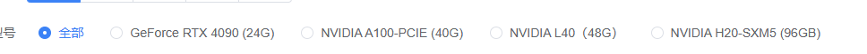

GPU 选择指南
==============

本章节介绍如何根据需求选择合适的 GPU 型号。

选择 GPU 的三个关键步骤
-----------------------

第一步：查看架构和 CUDA 版本支持
~~~~~~~~~~~~~~~~~~~~~~~~~~~~~~~~

不同的 GPU 架构支持不同的 CUDA 版本，这会影响您能使用的深度学习框架版本。

GPU 架构对照表
^^^^^^^^^^^^^^

.. list-table::
   :header-rows: 1
   :widths: 20 20 30 30

   * - GPU 型号
     - 架构
     - 支持的 CUDA 版本
     - 适用框架
   * - **H100**
     - Hopper
     - CUDA 11.8+
     - PyTorch 2.0+, TensorFlow 2.12+
   * - **H800**
     - Hopper
     - CUDA 11.8+
     - PyTorch 2.0+, TensorFlow 2.12+
   * - **A100**
     - Ampere
     - CUDA 11.0+
     - PyTorch 1.7+, TensorFlow 2.4+
   * - **A800**
     - Ampere
     - CUDA 11.0+
     - PyTorch 1.7+, TensorFlow 2.4+
   * - **RTX 4090**
     - Ada Lovelace
     - CUDA 11.8+
     - PyTorch 2.0+, TensorFlow 2.11+
   * - **RTX 4080**
     - Ada Lovelace
     - CUDA 11.8+
     - PyTorch 2.0+, TensorFlow 2.11+
   * - **L40**
     - Ada Lovelace
     - CUDA 11.8+
     - PyTorch 2.0+, TensorFlow 2.11+
   * - **RTX 3090**
     - Ampere
     - CUDA 11.0+
     - PyTorch 1.7+, TensorFlow 2.4+
   * - **V100**
     - Volta
     - CUDA 9.0+
     - PyTorch 1.0+, TensorFlow 1.5+

.. note::

   **选择建议**
   
   * 如果使用最新的深度学习框架，建议选择 Ampere 或更新的架构
   * 旧架构（如 Volta）可能不支持某些新特性（如 TF32、BF16）

第二步：性能排序（从高到低）
~~~~~~~~~~~~~~~~~~~~~~~~~~~~

根据计算性能和训练速度，GPU 性能排序如下：

训练性能排序
^^^^^^^^^^^^

**数据中心级 GPU（最强性能）**

1. **H100 (80GB)** ⭐⭐⭐⭐⭐
   
   * FP32: ~67 TFLOPS
   * TF32: ~989 TFLOPS
   * FP16: ~1979 TFLOPS
   * **最适合**：大规模模型训练、Transformer 模型、多模态模型

2. **H800 (80GB)** ⭐⭐⭐⭐⭐
   
   * 性能与 H100 相近
   * **最适合**：大规模模型训练、科研项目

3. **A100 (80GB)** ⭐⭐⭐⭐⭐
   
   * FP32: ~19.5 TFLOPS
   * TF32: ~156 TFLOPS
   * FP16: ~312 TFLOPS
   * **最适合**：深度学习训练、大模型微调

4. **A800 (80GB)** ⭐⭐⭐⭐⭐
   
   * 性能与 A100 相近
   * **最适合**：深度学习训练、科研项目

**专业级 GPU（高性能）**

5. **L40 (48GB)** ⭐⭐⭐⭐
   
   * FP32: ~90 TFLOPS
   * **最适合**：AI 推理、图形渲染、视频处理

6. **RTX 4090 (24GB)** ⭐⭐⭐⭐
   
   * FP32: ~82.6 TFLOPS
   * **最适合**：个人研究、中小型模型训练、游戏开发

7. **RTX 4080 (16GB)** ⭐⭐⭐
   
   * FP32: ~48.7 TFLOPS
   * **最适合**：个人开发、小型模型训练

**上一代高性能 GPU**

8. **A100 (40GB)** ⭐⭐⭐⭐
   
   * 性能同 80GB 版本，但显存较小
   * **最适合**：中等规模模型训练

9. **RTX 3090 (24GB)** ⭐⭐⭐
   
   * FP32: ~35.6 TFLOPS
   * **最适合**：性价比训练、个人研究

10. **V100 (32GB)** ⭐⭐⭐
    
    * FP32: ~15.7 TFLOPS
    * **最适合**：传统深度学习任务

性能对比总结
^^^^^^^^^^^^

.. code-block:: text

   训练速度排序（相对性能）：
   H100/H800 (100%) > A100/A800 (40%) > RTX 4090 (35%) > 
   L40 (30%) > RTX 4080 (20%) > RTX 3090 (15%) > V100 (10%)

.. tip::

   **性能选择建议**
   
   * **大模型训练**（GPT、LLaMA 等）：H100/H800/A100
   * **中型模型训练**（ResNet、BERT 等）：A100/RTX 4090/L40
   * **小型模型/微调**：RTX 4090/RTX 4080/RTX 3090
   * **推理部署**：L40/RTX 4090
   * **预算有限**：RTX 3090/V100

第三步：查看显存大小
~~~~~~~~~~~~~~~~~~~~

显存大小决定了您能训练的模型规模和批次大小。

显存规格对照
^^^^^^^^^^^^

.. list-table::
   :header-rows: 1
   :widths: 30 20 50

   * - GPU 型号
     - 显存大小
     - 适用场景
   * - **H100**
     - 80GB
     - 超大模型训练（100B+ 参数）
   * - **H800**
     - 80GB
     - 超大模型训练（100B+ 参数）
   * - **A100**
     - 40GB / 80GB
     - 大模型训练（7B-70B 参数）
   * - **A800**
     - 40GB / 80GB
     - 大模型训练（7B-70B 参数）
   * - **L40**
     - 48GB
     - 中大型模型训练/推理
   * - **RTX 4090**
     - 24GB
     - 中型模型训练（<13B 参数）
   * - **RTX 4080**
     - 16GB
     - 小型模型训练（<7B 参数）
   * - **RTX 3090**
     - 24GB
     - 中型模型训练（<13B 参数）
   * - **V100**
     - 16GB / 32GB
     - 传统深度学习模型

显存需求估算
^^^^^^^^^^^^

**常见模型的显存需求**（训练时，batch_size=1）

.. code-block:: text

   ResNet-50:        ~2GB
   BERT-Base:        ~4GB
   BERT-Large:       ~8GB
   GPT-2 (1.5B):     ~12GB
   LLaMA-7B:         ~28GB (需要 40GB+ GPU)
   LLaMA-13B:        ~52GB (需要 80GB GPU 或多卡)
   LLaMA-70B:        ~280GB (需要多卡并行)

.. warning::

   **显存不足的影响**
   
   * 无法加载模型
   * 只能使用很小的 batch size（训练慢）
   * 无法使用某些优化技术（如混合精度训练）

显存优化技巧
^^^^^^^^^^^^

如果显存不足，可以尝试：

1. **减小 batch size**
2. **使用梯度累积**（gradient accumulation）
3. **使用混合精度训练**（FP16/BF16）
4. **使用梯度检查点**（gradient checkpointing）
5. **使用模型并行或数据并行**
6. **使用 LoRA 等参数高效微调方法**

GPU 选择决策树
--------------

.. code-block:: text

   开始选择 GPU
   │
   ├─ 预算充足 + 大模型训练（70B+）
   │  └─> H100 / H800 (80GB)
   │
   ├─ 大模型训练（7B-70B）
   │  └─> A100 / A800 (80GB)
   │
   ├─ 中型模型训练 + 高性能需求
   │  └─> A100 (40GB) / RTX 4090 (24GB)
   │
   ├─ AI 推理 + 图形处理
   │  └─> L40 (48GB)
   │
   ├─ 个人研究 + 中小型模型
   │  └─> RTX 4090 (24GB) / RTX 4080 (16GB)
   │
   ├─ 预算有限 + 中型模型
   │  └─> RTX 3090 (24GB)
   │
   └─ 传统深度学习 + 预算有限
      └─> V100 (32GB)

常见应用场景推荐
----------------

计算机视觉
~~~~~~~~~~

* **图像分类**（ResNet, EfficientNet）: RTX 3090 / RTX 4080
* **目标检测**（YOLO, Faster R-CNN）: RTX 4090 / A100
* **图像分割**（Mask R-CNN, U-Net）: RTX 4090 / A100
* **视频处理**: L40 / RTX 4090

自然语言处理
~~~~~~~~~~~~

* **BERT 微调**: RTX 3090 / RTX 4090
* **GPT 系列训练**: A100 / H100
* **LLaMA 微调**: A100 (80GB) / H100
* **大模型推理**: L40 / A100

多模态模型
~~~~~~~~~~

* **CLIP 训练**: A100
* **Stable Diffusion**: RTX 4090 / A100
* **多模态大模型**: H100 / A100 (80GB)

科学计算
~~~~~~~~

* **分子动力学**: A100 / V100
* **气候模拟**: H100 / A100
* **量子计算模拟**: H100

.. tip::

   **最终建议**
   
   1. **优先考虑显存大小**：确保能装下您的模型
   2. **其次考虑性能**：影响训练速度和成本
   3. **最后考虑架构**：确保支持您需要的 CUDA 版本
   4. **多卡并行**：如果单卡显存不够，考虑租用多张卡
