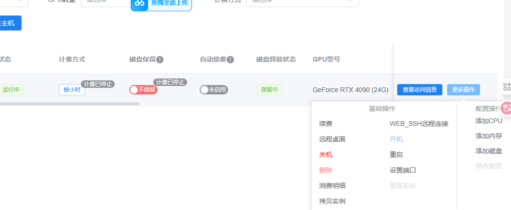
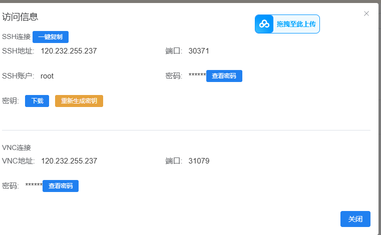

实例管理与使用
================

本章节介绍如何管理和使用已创建的云主机实例。

实例操作
--------

开机与关机
~~~~~~~~~~

在实例管理页面，您可以对实例进行以下操作：

* **开机**：启动已关机的实例
* **关机**：关闭正在运行的实例
* **重启**：重新启动实例
* **删除**：删除不再需要的实例

.. warning::

   **关于关机的重要说明**
   
   如果开启了自动续费，即使关机状态下也会继续按小时扣费。建议不使用时删除实例或关闭自动续费。

查看访问信息
~~~~~~~~~~~~

点击实例的 **"查看访问信息"** 按钮，可以查看连接所需的详细信息：

访问信息包括：

* **SSH 连接**
  
  * SSH 地址：服务器 IP 地址
  * 端口：SSH 端口号
  * 账户：登录用户名（通常为 root）
  * 密码：登录密码（可点击"查看密码"显示）

* **VNC 连接**
  
  * VNC 地址：远程桌面地址
  * 端口：VNC 端口号
  * 密码：VNC 登录密码

.. tip::

   建议将访问信息保存到安全的地方，以便随时使用。
